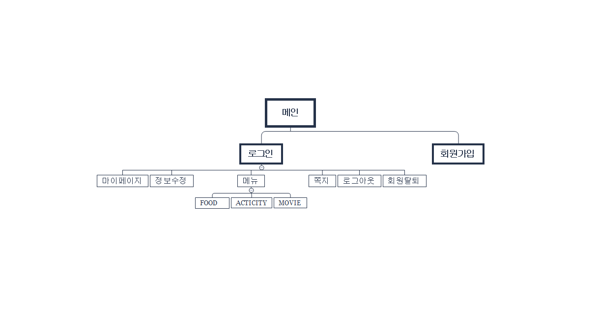

# DateShareProject
> Html5, Css3, Javascript, JQuery, Jsp, Oracle DB, Ajax 를 이용해 만든 데이트 콘텐츠 공유 플랫폼

## 목차 
* 회원가입/로그인/로그아웃/회원탈퇴
* 마이페이지
* 맛집 게시판
* 엑티비티 게시판
* 영화 게시판
* 쪽지

## 기술 
* `HTML5`
* `CSS3`
* `Javascript`
* `jQuery`
* `JSP` 이용하여 내부 객체 속성으로 데이터 처리, EL + JSTL 
* `JDBC` - `Oracle` + DAO 패턴 이용 
* 커넥션 풀 등록 
* `ajax` 비동기통신

## 프로젝트 설명 PPT 
* 각 기능 설명 
* 구현 중 겪었던 어려움 
* 협업과정에서의 문제점
* 개선방향 
* [LINK](https://docs.google.com/presentation/d/1XWXNxqtIb0XEzUAYzxcawTjbaJBZA_qO5lS77M49chY/edit#slide=id.g5de772eecd_0_66)
